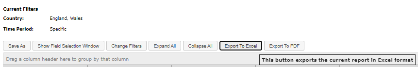
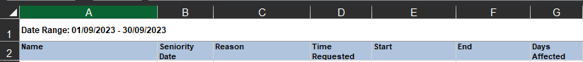

# desk-report-tool

An internal tool for generating .csv reports for desk bookings per employee both company wide and for each district at Tes over a given time period.

## How to Use:

## 1. Getting the Data

In order to run, this tool requires three data sources, all of which need to be present in the data folder in the form of .xlsx files:

1. An Excel document generated by Condeco which provides data on personal desk bookings for a given time period. Please see the guidance below for more information on how to generate this file.
2. An Excel document provided by HR and generated from Dayforce which provides data on employee absences for a given time period. Please see the guidance below when asking HR for this document.
3. An Excel document which provides location data for each employee at Tes. This is not time specific, but should be updated at regular intervals, so as to reflect changes to employees' contracts, etc. Please speak to HR when you need to update this document.

### Generating the data from Condeco

Admin rights are required in order to generate a report from Condeco. Once admin rights have been granted, you will see numerous options listed down the left-hand side of the screen once you've clicked off the 'today' page.

Click on 'Advanced Reports' and navigate to 'Desk Reports' (top right), then click on 'View Reports / Create New'.

You are then presented with various options under 'Standard Reports'. Navigate to the third option, 'Desks Allocated to People', and click 'Run / Edit'.

You will then be presented with a table representing all bookings for a given period. To edit the default period (last week), click on the 'Change Filters' button.

This will open a window allowing you to change various filtering options. Click on 'Country' and uncheck the 'Australia' option.

Next, click on the time period, click 'Specific' and use the calendar to enter the time period you require.

Once you've clicked 'Refresh Data', the window will close and the information in the table will be updated. To export this to Excel, click the 'Export to Excel' button.

Condeco will export the file as an .xls file. Make sure that you convert this to an .xlsx file by opening and re-saving the file or changing the file type manually.

Lastly, <strong>ensure that the file is saved in the data folder under the name 'condecoData.xlsx' (case sensitive)</strong>.

### Getting the Dayforce absences from HR

When asking HR for an Excel document of staff absences, please ensure that the first cell (A:1) contains the time period specified, such as for September 2023.

It is important that this information is also sanitised by HR so that the reasons for absences are not included.

Finally, please <strong>ensure that the file is saved in the data folder under the name 'dayforceData.xlsx' (case sensitive)</strong>.

### Getting the location (employee contract) data from HR

As with the Dayforce absences data, when you come to renew the location data, please ask HR to sanitise it and present it in the same format as the previous document.

Remember to <strong>ensure that the file is saved in the data folder under the name 'locationData.xlsx' (case sensitive)</strong>.

## 2. Running the report

Once the Excel documents have been corrently named and placed in the data folder in the correct format. To generate the reports, double click on the GenerateReports.bat file. This will open up a Command Prompt window on your computer.

You'll be prompted to enter a start date for the time period for which you want to get reports.

The prompter will then ask for the end date. Please <strong>ensure that both the start and end dates are entered in the correct format (yyyy-mm-dd)</strong>.

If the time period that you've entered does not fall within the that covered by both the condecoData.xlsx file and the dayforceData.xlsx file, then you will be presented with the following error.

> _<strong>Important note</strong>: The data contained within the condecoData.xlsx file might not span the whole month, even though that was the time period entered when exporting the data to Excel. It will only list all the bookings within a given time period, so be mindful of weekend days at either end of the period in question._  

If the time period falls within the data provided, then you will be presented with an output listing the reports generated.

Finally, press any key to exit the command prompt. The reports generated by the process will be located in the 'reports' folder in the form of .csv files and will be labelled by 'district' (department) or 'All' and time period.
